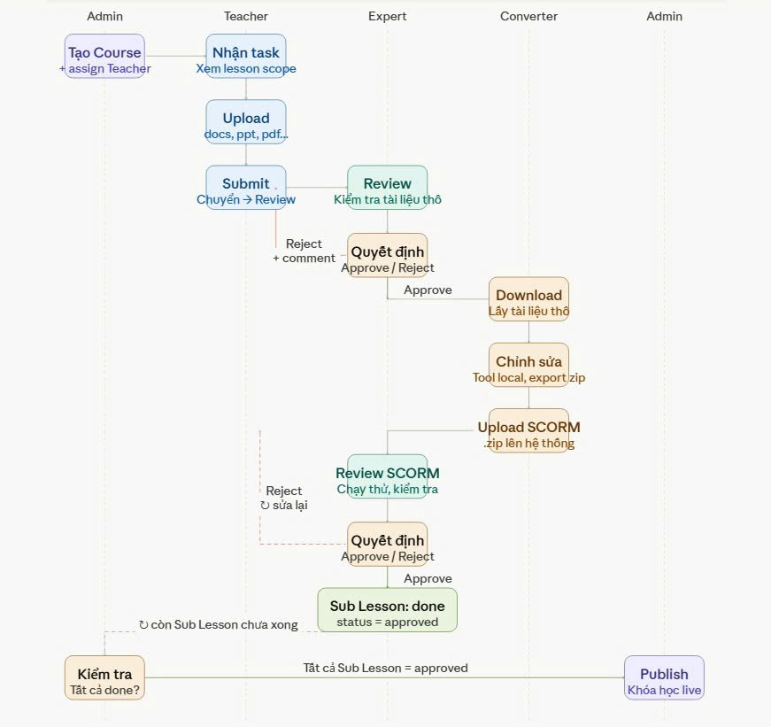
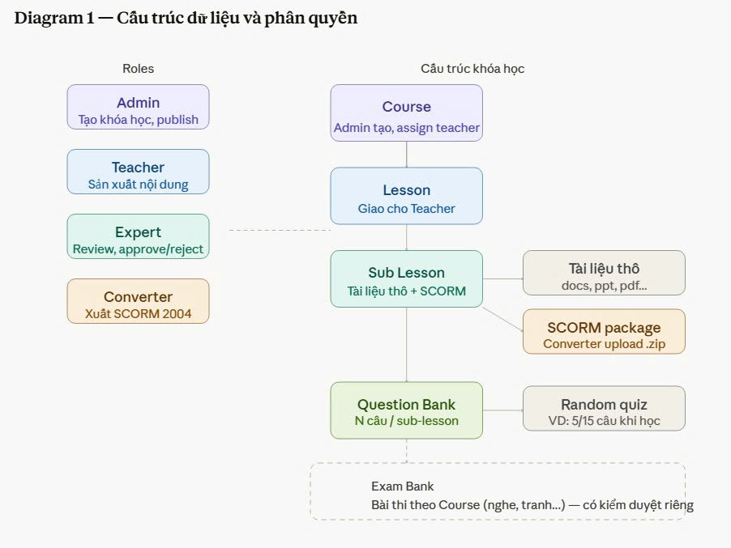

# HSK LCMS — Đặc tả Chức năng

> **Tài liệu mô tả chức năng hệ thống HSK LCMS từ góc nhìn người dùng**
>
> *Tài liệu này tập trung vào: vai trò, quyền hạn, luồng nghiệp vụ, màn hình và tương tác của từng nhóm người dùng.*

---

## Mục lục

1. [Các bên liên quan & vai trò](#1-các-bên-liên-quan--vai-trò)
2. [Quyền người dùng](#2-quyền-người-dùng)
3. [Quy trình sản xuất học liệu](#3-quy-trình-sản-xuất-học-liệu)
4. [Luồng phê duyệt & thẩm định](#4-luồng-phê-duyệt--thẩm-định)
5. [Chuyển đổi SCORM](#5-chuyển-đổi-scorm)
6. [Ngân hàng câu hỏi & Bài thi](#6-ngân-hàng-câu-hỏi--bài-thi)
7. [Thông báo & Email](#7-thông-báo--email)

---

## 1. Các bên liên quan & vai trò

### 1.1 Danh sách vai trò

| Vai trò | Mô tả |
|---|---|
| **Giáo viên** (Teacher) | Giáo viên / chuyên gia nội dung, tạo và upload tài liệu bài học |
| **Chuyên gia** (Expert) | Chuyên gia cao cấp, đánh giá và phê duyệt nội dung |
| **Người chuyển đổi học liệu** (Converter) | Chịu trách nhiệm chuyển đổi tài liệu sang định dạng SCORM |
| **Quản trị viên** (Admin) | Quản lý người dùng, gán vai trò, tạo và xuất bản khóa học |

> **Ghi chú về Learner:** Vai trò Learner (người học) **không nằm trong phạm vi hệ thống LCMS này**. Learner chỉ tồn tại trong hệ thống LMS bên ngoài. LCMS chỉ chịu trách nhiệm sản xuất và quản lý học liệu (Course, Lesson, Sub-Lesson, SCORM, Question Bank). LMS sẽ tiêu thụ học liệu do LCMS cung cấp.

---

## 2. Quyền người dùng

### 2.1 Mô hình phân quyền

Hệ thống sử dụng **Role-Based Access Control (RBAC)** — mỗi người dùng được gán **một hoặc nhiều vai trò**, quyền hạn được xác định hoàn toàn bởi vai trò đó. Không có phân quyền chi tiết từng resource (granular permission).

- Mỗi người dùng có thể mang **nhiều vai trò** (ví dụ: vừa là Teacher vừa là Expert, không hạn chế); quyền hạn = **union** của tất cả vai trò được gán
- Admin gán vai trò cho người dùng từ danh sách vai trò có sẵn trong hệ thống
- Không có quyền `manage` dạng `resource.action`; tất cả quyền gắn liền với vai trò
- Admin có thể tạo **vai trò tùy chỉnh** (custom roles) dựa trên template có sẵn

### 2.2 Quyền theo vai trò mặc định

#### Admin (Quản trị viên)
- Quản lý người dùng, gán vai trò cho người dùng khác
- Tạo khóa học (Course)
- Xuất bản (Publish) khóa học

> **Admin không sản xuất nội dung hay thẩm định/phê duyệt.** Khi tạo khóa học, Admin gán **đúng 1 Expert** duy nhất để kiểm duyệt khóa học đó. Mỗi khóa học chỉ có một Expert phụ trách kiểm duyệt.

#### Teacher (Giáo viên)
- Quản lý Lesson, Sub-Lesson trong Lesson mà mình được gán phụ trách
- Upload, xem, tải, xóa tài liệu (Content) trong Sub-Lesson mình phụ trách
- Tạo và quản lý ngân hàng câu hỏi (Question Bank) cho Sub-Lesson mình phụ trách
- Gửi phê duyệt nội dung

#### Expert (Chuyên gia)
- Xem (chỉ đọc) toàn bộ Lesson và Sub-Lesson trong Course được gán kiểm duyệt
- Xem và tải tài liệu trong Sub-Lesson
- Phê duyệt / từ chối nội dung và SCORM cho toàn bộ Sub-Lesson trong Course
- Xem (chỉ đọc) ngân hàng câu hỏi và bài thi

> **Phạm vi xem của Expert:** Expert chỉ được gán kiểm duyệt 1 Course duy nhất, nên Expert nhìn thấy toàn bộ nội dung trong Course đó (tất cả Lesson và Sub-Lesson), không nhìn thấy các Course khác.

#### Converter (Người chuyển đổi học liệu)
- Xem (chỉ đọc) khóa học được gán
- Xem nội dung, tải tài liệu và upload SCORM cho Sub-Lesson trong Lesson mà mình được gán phụ trách

---

## 3. Quy trình sản xuất học liệu

### 3.1 Tổng quan luồng



### 3.2 Cấu trúc dữ liệu học liệu



### 3.3 Các bước chi tiết

#### Bước 1 — Admin tạo khóa học & gán Expert

- Admin đăng nhập → tạo Course mới
- Thông tin Course: tên, mô tả
- **Admin gán đúng 1 Expert duy nhất** để kiểm duyệt khóa học này
- Sau khi tạo, Admin tạo các Lesson. Mỗi Lesson được gán:
  - **Đúng 1 Teacher** để sản xuất nội dung học liệu cho các Sub-Lesson trong Lesson đó
  - **Đúng 1 Converter** để chuyển đổi SCORM cho các Sub-Lesson trong Lesson đó
- Mỗi Lesson chỉ có một Teacher và một Converter phụ trách, không thay đổi trong quá trình sản xuất

#### Bước 2 — Teacher sản xuất nội dung

**3.3.1 Cấu trúc nội dung**

```
Course (Khóa học HSK)
└── Lesson 1: Chủ đề Gia đình và Bạn Bè (Family)
│   ├── Teacher: [Giáo viên A]  ← gán theo Lesson
│   ├── Converter: [Chuyên viên A]  ← gán theo Lesson
│   ├── Sub-Lesson 1.1: Gia đình (Family)
│   │   ├── Content (Tài liệu)
│   │   │   ├── bai-giang-gia-dinh.pptx
│   │   │   ├── bai-tap-gia-dinh.pdf
│   │   │   └── tu-vung-gia-dinh.docx
│   │   └── Question Bank (Ngân hàng câu hỏi)
│   │       └── Questions...
│   ├── Sub-Lesson 1.2: Bạn bè (Friends)
│   │   ├── Content
│   │   └── Question Bank
│   └── ...
└── Lesson 2: Chủ đề Trường học (School)
    ├── Teacher: [Giáo viên B]  ← gán theo Lesson
    ├── Converter: [Chuyên viên B]  ← gán theo Lesson
    └── ...
```

**3.3.2 Upload tài liệu (Content)**

- Teacher chọn Sub-Lesson → upload tài liệu gốc (Content/Document)
- **Có thể upload nhiều tài liệu** cho mỗi Sub-Lesson (ví dụ: bài giảng + bài tập + từ vựng)
- Hỗ trợ định dạng: `.pptx`, `.pdf`, `.docx`, `.doc`, `.xlsx`, `.xls`, `.ppt`
- Mỗi tài liệu có metadata: tên file, loại file, kích thước, người upload, ngày upload
- Tài liệu được lưu trên file storage (S3 / MinIO)

**3.3.3 Tạo ngân hàng câu hỏi (Question Bank)**

- Teacher chọn Sub-Lesson → tạo ngân hàng câu hỏi cho Sub-Lesson đó
- Thêm các câu hỏi vào ngân hàng: nội dung câu hỏi, loại câu hỏi, đáp án, điểm số
- Xem chi tiết tại [Mục 6 — Ngân hàng câu hỏi & Bài thi](#6-ngân-hàng-câu-hỏi--bài-thi)

**3.3.4 Gửi phê duyệt (Submit for Review)**

- Sau khi hoàn thành nội dung và ngân hàng câu hỏi, Teacher nhấn **"Gửi phê duyệt"**
- Hệ thống thông báo tới Expert đã được gán
- Teacher có thể thêm ghi chú kèm theo
- Hệ thống gửi **email thông báo** tới Expert

**3.3.5 Cộng tác nhiều Teacher / Converter**

- Mỗi Lesson có **đúng 1 Teacher** và **đúng 1 Converter** được gán, không thay đổi trong quá trình sản xuất
- Các Lesson khác nhau có thể được gán Teacher / Converter khác nhau, mỗi người có thể phụ trách nhiều Lesson
- Lịch sử chỉnh sửa được ghi lại (audit log)

#### Bước 3 — Expert kiểm duyệt nội dung

- Expert nhận **email thông báo** có nội dung: tên khóa học, tên Sub-Lesson, người gửi, ghi chú
- Expert đăng nhập → vào trang **"Sub-Lesson cần kiểm duyệt"**
- **Xem & tải tài liệu:** Expert click vào tài liệu để mở **popup preview** xem nội dung trực tiếp trên browser, đồng thời có nút **"Tải về"** để download file
- **Đánh giá** nội dung dựa trên các tiêu chí:
  - Độ chính xác ngữ pháp & từ vựng
  - Mức độ phù hợp với cấp độ HSK
  - Chất lượng trình bày
  - Tính đầy đủ của nội dung
- **Thực hiện một trong hai hành động:**

  - **Reject (Từ chối):** Nhập **comment** mô tả các issue (bắt buộc) → Hệ thống gửi **email** tới Teacher → Teacher chỉnh sửa và gửi lại
  - **Approve (Phê duyệt):** Nhập **ghi chú** (không bắt buộc) → Hệ thống chuyển trạng thái Sub-Lesson sang `IN_CONVERSION` và gửi **email** tới **Converter** để tiến hành chuyển đổi SCORM

#### Bước 4 — Converter chuyển đổi SCORM

- Converter nhận **email thông báo** từ hệ thống
- Đăng nhập → xem danh sách Sub-Lesson cần chuyển đổi
- Tải các tài liệu (ppt, pdf, docx...) về máy
- Sử dụng **tool chuyển đổi SCORM** đã cài đặt trên máy
- Tool hỗ trợ: `.pptx`, `.pdf`, `.docx` → **`.zip` (SCORM 2004)** — kết quả là **1 file .zip duy nhất**
- Sau khi chuyển đổi, Converter upload **file .zip** duy nhất lên hệ thống
- Hệ thống hỗ trợ **preview** bài học SCORM trực tiếp trên trình duyệt (dùng package scorm-again để preview)
- Hệ thống tự động gửi **email thông báo** tới Expert để tiến hành phê duyệt lần 2

#### Bước 5 — Expert kiểm duyệt SCORM lần 2

- Expert nhận thông báo có SCORM mới cho Sub-Lesson
- Xem nội dung SCORM trực tiếp trên hệ thống
- Thực hiện **Approve** hoặc **Reject**:
  - **Reject**: Gửi comment → Email tới Converter → Converter sửa và upload lại
  - **Approve**: Sub-Lesson chuyển sang APPROVED → hoàn thành

#### Bước 6 — Admin xuất bản (Publish) Course

- Khi **tất cả Sub-Lesson** trong Course đã được Expert approve SCORM, Course mới được coi là **hoàn thành** và sẵn sàng xuất bản
- Hệ thống hiển thị trạng thái tổng quan của Course (số Sub-Lesson đã hoàn thành / tổng số)
- Admin nhận thông báo → đăng nhập → nhấn **"Publish Course"** khi tất cả đã hoàn thành
- Trạng thái Course cập nhật → `PUBLISHED`
- Toàn bộ Course (tất cả Sub-Lesson) đã publish sẽ được LMS bên ngoài tiêu thụ (hiển thị cho Learner)
- Email thông báo tới các bên liên quan (Teacher, Expert)

### 3.4 Trạng thái nội dung

#### Trạng thái Sub-Lesson

| Trạng thái | Actor | Mô tả |
|---|---|---|
| `DRAFT` | System | Mới tạo, Teacher chưa làm gì |
| `IN_PROGRESS` | Teacher | Đang upload file content và soạn câu hỏi |
| `SUBMITTED` | Teacher | Đã gửi, chờ Expert nhận review |
| `REVIEWING` | Expert | Expert đang review content + câu hỏi cùng lúc |
| `IN_CONVERSION` | System | Converter nhận việc, đang làm SCORM trên máy local |
| `SCORM_UPLOADED` | Converter | Đã upload .zip, chờ Expert review lần 2 |
| `SCORM_REVIEWING` | Expert | Expert đang chạy thử SCORM player, kiểm tra hiển thị |
| `APPROVED` | System | Hoàn thành, tính vào điều kiện của Course |

#### Trạng thái Lesson

| Trạng thái | Mô tả |
|---|---|
| `DRAFT` | Mới tạo, tất cả Sub-Lesson đều là DRAFT |
| `IN_PROGRESS` | Đang sản xuất, ít nhất 1 Sub-Lesson đang được làm |
| `APPROVED` | Tất cả Sub-Lesson đã APPROVED, tính vào điều kiện Course |

#### Trạng thái Course

| Trạng thái | Mô tả |
|---|---|
| `DRAFT` | Đang trong quá trình sản xuất nội dung |
| `IN_PROGRESS` | Một số Sub-Lesson đã hoàn thành, một số đang làm |
| `APPROVED` | Tất cả Lesson/Sub-Lesson đã APPROVED, sẵn sàng xuất bản |
| `PUBLISHED` | Đã xuất bản toàn bộ Course |
| `ARCHIVED` | Đã lưu trữ |

---

## 4. Luồng phê duyệt & thẩm định

### 4.1 Lặp lại quy trình

```
Teacher nộp nội dung (SUBMITTED)
    └─► Expert nhận review (REVIEWING)
              └─► Expert Reject ──► Teacher chỉnh sửa (DRAFT)
              └─► Expert Approve ──► System chuyển Converter (IN_CONVERSION)
                                            └─► Converter upload SCORM (SCORM_UPLOADED)
                                                  └─► Expert review SCORM (SCORM_REVIEWING)
                                                          └─► Expert Reject SCORM ──► Converter chỉnh sửa (SCORM_UPLOADED)
                                                          └─► Expert Approve SCORM ──► APPROVED
```

> Quy trình có thể lặp lại nhiều lần cho đến khi nội dung được phê duyệt. Khi Sub-Lesson APPROVED, hệ thống tự động kiểm tra trạng thái Lesson và Course tương ứng.

### 4.2 Quyền publish

- Chỉ **Admin** có quyền xuất bản (Publish) Course
- Teacher và Expert không có quyền publish

---

## 5. Chuyển đổi SCORM

### 5.1 Giới thiệu SCORM

SCORM (Sharable Content Object Reference Model) là chuẩn quốc tế cho nội dung e-learning, cho phép nội dung có thể tái sử dụng, tương tác được và có thể theo dõi tiến độ học tập.

### 5.2 Quiz trong SCORM

Quiz là các câu hỏi kèm đáp án được **đóng gói sẵn bên trong nội dung SCORM**. Quiz nằm trong file `.zip` SCORM, hiển thị và xử lý phản hồi hoàn toàn bên trong SCORM player, không liên quan đến LCMS.

**Đặc điểm:**
- Quiz SCORM chỉ mang tính **ôn tập trong quá trình học**
- **Không ghi nhận kết quả** vào LCMS
- SCORM Runtime API tự động xử lý phản hồi (hiển thị đúng/sai ngay trong nội dung SCORM)
- Quiz SCORM do Converter đóng gói kèm SCORM, nằm ngoài phạm vi quản lý của LCMS

**Quy trình tạo Quiz SCORM:**

```
1.  Teacher gửi dữ liệu thô:
      └─► Slide bài giảng (PPT, PDF...)
      └─► File quiz kèm đáp án
2.  Converter tải dữ liệu thô về máy
3.  Converter chỉnh sửa slide, nhúng quiz vào nội dung
4.  Converter chạy tool chuyển đổi:
      PPT → SCORM package (.zip)
      (câu hỏi trong slide được chuyển thành SCORM interaction)
5.  Converter upload SCORM .zip lên hệ thống
6.  Expert duyệt SCORM → Approve
7.  SCORM hoàn thành
8.  LMS tiêu thụ Sub-Lesson đã publish:
      └─► Câu hỏi hiển thị TRONG quá trình xem SCORM
      └─► SCORM Runtime API xử lý phản hồi (hiển thị đúng/sai)
      └─► Kết quả quiz SCORM KHÔNG được ghi nhận vào LCMS
```

### 5.3 Question trong ngân hàng câu hỏi

Question là câu hỏi được thiết kế theo nội dung bài học, nằm trong **ngân hàng câu hỏi** của LCMS, không nằm trong SCORM. Sau khi bài học được publish, LMS bên ngoài sẽ random câu hỏi từ ngân hàng để đánh giá người học và ghi nhận kết quả.

### 5.4 Quản lý SCORM trong hệ thống

- Mỗi **Sub-Lesson** chỉ có **một** SCORM package
- Hệ thống lưu trữ: file `.zip`, version SCORM, người upload, thời gian
- Hỗ trợ **preview** trực tiếp trên iframe trong trình duyệt
- Ghi log quá trình chuyển đổi (conversion log)

---

## 6. Ngân hàng câu hỏi & Bài thi

### 6.1 Giới thiệu

Ngân hàng câu hỏi (Question Bank) là tập hợp các câu hỏi được thiết kế theo nội dung bài học, nằm trong **LCMS**, không nằm trong SCORM.

Bài thi (Exam) là tập hợp câu hỏi được tạo từ Question Bank, dùng để đánh giá người học. Việc thi và ghi nhận kết quả thuộc phạm vi **hệ thống LMS bên ngoài** — LCMS chỉ chịu trách nhiệm tạo, quản lý và xuất bản Question Bank / Exam.

### 6.2 Quyền theo vai trò

| Vai trò | Question Bank | Bài thi |
|---|---|---|
| Admin | Không có quyền | Không có quyền |
| Teacher | Tạo / chỉnh sửa (cho Sub-Lesson mình phụ trách) | Tạo từ Question Bank |
| Expert | Chỉ đọc | Chỉ đọc |
| Converter | Không có quyền | Không có quyền |

### 6.3 Entity và cấu trúc

```
Question Bank (Ngân hàng câu hỏi)
└── Question (Câu hỏi)
    ├── Nội dung câu hỏi
    ├── Loại câu hỏi (multiple-choice, true/false, fill-in-blank...)
    ├── Danh sách đáp án (có đánh dấu đáp án đúng)
    ├── Điểm số
    └── Metadata: người tạo, ngày tạo, Sub-Lesson liên kết

Exam (Bài thi)
├── Tên bài thi
├── Mô tả
├── Sub-Lesson liên kết
├── Question Bank nguồn
├── Số câu hỏi random (khi thi, LMS sẽ random từ Question Bank)
├── Thời gian làm bài (phút)
├── Điểm đạt (%)
├── Trạng thái: DRAFT | PUBLISHED | ARCHIVED
└── Metadata: người tạo, ngày tạo, ngày publish
```

### 6.4 Luồng tạo & xuất bản Question Bank / Exam

```
Step 1 (Teacher)
─────────────────
Tạo / chỉnh sửa Question Bank cho Sub-Lesson
  └─► Tạo / chỉnh sửa Exam từ Question Bank
        └─► Gửi phê duyệt (Submit for Review)

Step 2 (Expert)
─────────────────
Phê duyệt / từ chối Exam
  ├─ Reject ──► Teacher chỉnh sửa ──► Gửi lại
  └─ Approve ──► Trạng thái: PUBLISHED
                      └─► Exam sẵn sàng cho LMS tiêu thụ
```

### 6.5 Quiz SCORM vs Question trong ngân hàng câu hỏi

Hệ thống phân biệt rõ Quiz và Question:

| | Quiz SCORM | Question |
|---|---|---|
| **Vị trí** | Bên trong nội dung SCORM (`.zip`) | Ngân hàng câu hỏi trong LCMS |
| **Mục đích** | Ôn tập trong quá trình học | Đánh giá sau khi hoàn thành bài học |
| **Xử lý phản hồi** | SCORM Runtime API (trong trình duyệt) | LMS xử lý & ghi nhận kết quả |
| **Kết quả** | **Không** ghi nhận vào LCMS | **Có** ghi nhận vào LMS |
| **Ai tạo** | Teacher chuẩn bị, Converter đóng gói | Teacher tạo trong ngân hàng câu hỏi |

**Quiz SCORM:**
- Quiz được Teacher chuẩn bị trong file dữ liệu thô, Converter nhúng vào slide và đóng gói cùng SCORM
- Hiển thị bên trong SCORM player (iframe), SCORM Runtime API xử lý đúng/sai
- Kết quả quiz không được LCMS ghi nhận

**Question (Ngân hàng câu hỏi):**
- Question do Teacher tạo, quản lý trong ngân hàng câu hỏi của LCMS theo từng Sub-Lesson
- Exam được tạo từ Question Bank, sau khi được Expert phê duyệt sẽ được publish
- LMS bên ngoài sẽ random câu hỏi từ Exam để đánh giá người học và ghi nhận kết quả

---

## 7. Thông báo & Email

### 7.1 Các sự kiện kích hoạt email

| # | Sự kiện | Người nhận | Nội dung |
|---|---|---|---|
| 1 | Teacher gửi phê duyệt | Expert | Có Sub-Lesson mới cần kiểm duyệt, link tới Sub-Lesson |
| 2 | Expert Reject Sub-Lesson | Teacher | Sub-Lesson bị từ chối, danh sách issue, comment |
| 3 | Expert Approve content | Converter (Lesson) | Sub-Lesson content/câu hỏi đã phê duyệt, cần chuyển đổi SCORM |
| 4 | Converter upload SCORM | Expert | Có SCORM mới cần kiểm duyệt lần 2 |
| 5 | Expert Reject SCORM | Converter (Lesson) | SCORM bị từ chối, comment |
| 6 | Expert Approve SCORM | Admin, Teacher, Converter (Lesson) | Sub-Lesson hoàn thành, sẵn sàng xuất bản |
| 7 | Admin publish Course | Admin, Teacher, Expert, Converter (Lesson) | Toàn bộ Course đã được xuất bản |
| 8 | Teacher gửi phê duyệt Exam | Expert | Có bài thi mới cần kiểm duyệt, link tới Exam |
| 9 | Expert Reject Exam | Teacher | Exam bị từ chối, danh sách issue, comment |
| 10 | Expert Approve Exam | Admin, Teacher | Exam đã phê duyệt, sẵn sàng xuất bản |
| 11 | Thêm Teacher vào Lesson | Teacher mới | Đã được gán vào Lesson X của khóa học Y |
| 12 | Thêm Converter vào Lesson | Converter mới | Đã được gán vào Lesson X của khóa học Y để chuyển đổi SCORM |
| 13 | Gán Expert kiểm duyệt | Expert mới | Đã được gán kiểm duyệt khóa học Y |

### 7.2 Mẫu email

Tất cả email sử dụng template có cấu trúc:
- Header: Logo HSK LCMS
- Body: Nội dung sự kiện
- CTA Button: Link tới hệ thống
- Footer: Thông tin liên hệ

### 7.3 Thông báo trong hệ thống

- Ngoài email, hệ thống còn hiển thị **notification** trong giao diện
- Teacher/Expert/Converter/Admin có thể xem danh sách thông báo
- Hỗ trợ đánh dấu đã đọc từng thông báo hoặc tất cả

---

## Phụ lục A — Gán vai trò cho người dùng (Admin)

Admin gán vai trò cho người dùng từ danh sách vai trò có sẵn. Không có phân quyền chi tiết từng resource.

```
┌─────────────────────────────────────────────────────────────┐
│  Gán vai trò cho: [Tên người dùng]                          │
├─────────────────────────────────────────────────────────────┤
│                                                             │
│  □ Admin                                                    │
│  □ Teacher                                                  │
│  □ Expert                                                   │
│  □ Converter                                                │
│                                                             │
└─────────────────────────────────────────────────────────────┘
```

Mỗi người dùng có thể được gán **nhiều vai trò**. Quyền hạn hiệu quả = union của tất cả vai trò được gán.

---

## Phụ lục B — Quiz SCORM vs Question trong ngân hàng câu hỏi (tóm tắt)

> Xem chi tiết tại [Mục 6.5](#65-quiz-scorm-vs-question-trong-ngân-hàng-câu-hỏi).

---

*Document version: 1.9*
*Created: 2026-04-18*
*Last updated: 2026-04-29*
*Project: nexvia-hsk-lcms*
